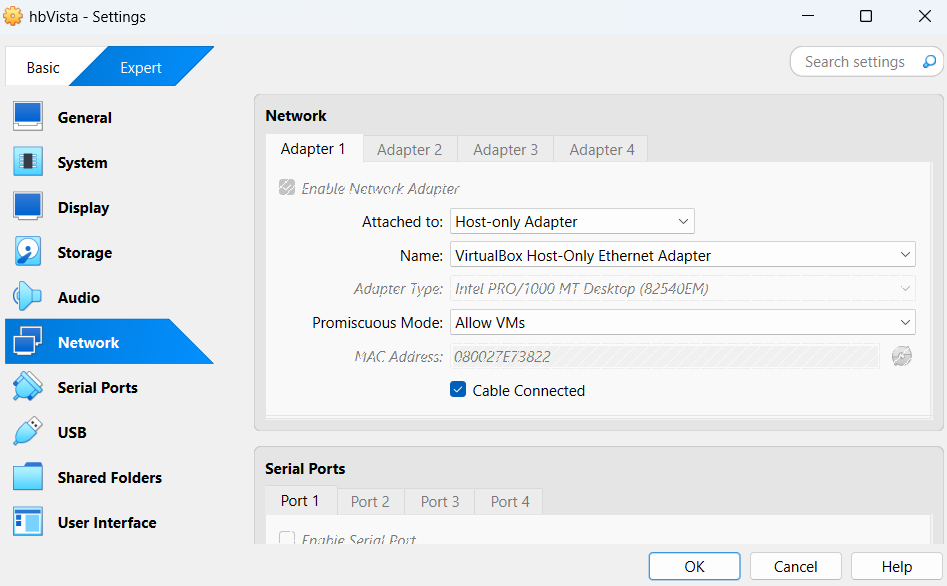
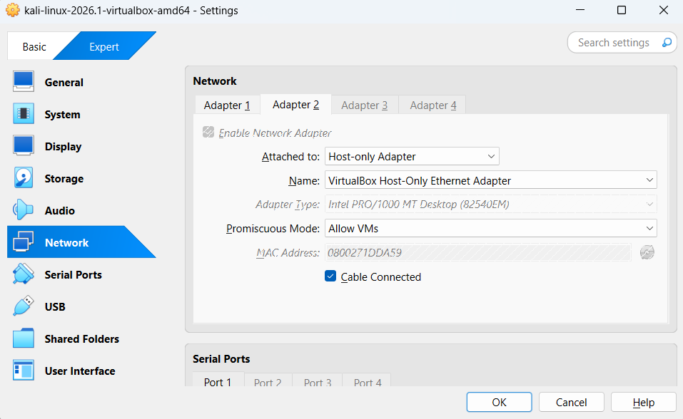

# Understanding Vulnerabilities (Exploitation)


A virtual machine (VM) file is provided in the `holberton.rar` file for this exercise.

Unrar the file into the `$HOME\VirtualBox VMs\holberton\`

The file `holberton.vmx` contains the configuration for the virtual machine, the most important for us:
- guestos = "winvista-64"
- numvcpus = "2"
- memsize = "4096"

This is a VMWare virtual machine but it can be run in VirtualBox.

Create a new virtual machine in VirtualBox with:

```
Name: hbVista
Type: Microsoft Windows
Version: Windows Vista (64-bit)
RAM: 4096 MB
CPU: 2
```

- When VBox asks for the hard disk, select "Use an existing virtual hard disk file" and add the `holberton.vmdk` file.

We configure both VMs (kali and windows) with shared `Host-only Adapter`-s.

For the Windows `hbVista` VM:



For the Kali VM keep the Adapter 1 as NAT and add a second adapter as Host-only Adapter:



Start both VMs.

In the Kali VM, run `ifconfig` to find the IP address of the Host-only Adapter (usually `192.168.56.x`).


## 0. Task: Discovery with Nmap

- Script: [0-nmap.sh](0-nmap.sh)
- Script output: [0-nmap.md](0-nmap.md)
- My answers: [0-my_nmap.md](0-my_nmap.md)


## 1. Task: Vulnerability Assessment with Nessus

- install Nessus on Kali [install_nessus](install_nessus.md)

- My results: [my_nessus_rapport.csv](my_nessus_rapport.csv)

containing findings for:

- MS11-030, Critical, CVSS 10.0
- Unsupported Windows OS, Critical, CVSS 10.0
- MS17-010 / EternalBlue, High, CVSS 8.8
- MS16-047 / Badlock, Medium, CVSS 6.8
- SMB Signing not required, Medium, CVSS 5.3
- SMBv1 enabled
- ICMP Timestamp disclosure

The most important finding for this task is **MS17-010**, the SMB vulnerability associated with EternalBlue, WannaCry, Petya, and related exploits.

- The "imported" version doesn't look like a csv: [nessus_rapport.csv](my_nessus_rapport.csv)


## 2. Task: CVE Research Using NVD

- The result in [2-ms_17_010.md](2-ms_17_010.md)

The key answers are:

- CVE ID: CVE-2017-0144
- Vulnerability: Remote code execution in Microsoft's SMBv1 server when processing specially crafted SMB packets. NVD lists Windows 7 SP1 among the affected systems.
- CVSS v3.1: 8.8 HIGH, vector CVSS:3.1/AV:N/AC:L/PR:L/UI:N/S:U/C:H/I:H/A:H.
- Impact: Arbitrary code execution, with high impact to confidentiality, integrity, and availability. NVD also lists it in CISA's Known Exploited Vulnerabilities catalog.
- Patch: Microsoft addressed it in MS17-010. For Windows 7 SP1, the relevant updates include KB4012212 Security Only and KB4012215 Monthly Rollup. Microsoft also lists disabling SMBv1 as a workaround.


## 3. Task:  Exploitation with Metasploit

- [metasploit.log](metasploit.log)
- flag: 7494eb5ca2cf10c1bdf5dcbf418998ce


## 4. Task: Post-Exploitation and Password Extraction

```bash
meterpreter > hashdump
# username:           RID:  LM_hash:                          NTLM_hash:::
Administrator:        500:  aad3b435b51404eeaad3b435b51404ee: 16a746500673b41d9a4dd37994a3a835:::
Guest:                501:  aad3b435b51404eeaad3b435b51404ee: 31d6cfe0d16ae931b73c59d7e0c089c0:::
Holderton_simpleuser: 1003: aad3b435b51404eeaad3b435b51404ee: 3aebfe39627c56e3ec440c9f432f73f3:::
HomeGroupUser$:       1002: aad3b435b51404eeaad3b435b51404ee: f580a1940b1f6759fbdd9f5c482ccdbb:::
```

Put Administrator and Holderton_simpleuser lines into `4-password_extraction.txt`

```bash
cat 4-password_extraction.txt 
Administrator:500:aad3b435b51404eeaad3b435b51404ee:16a746500673b41d9a4dd37994a3a835:::
Holderton_simpleuser:1003:aad3b435b51404eeaad3b435b51404ee:3aebfe39627c56e3ec440c9f432f73f3:::
```
